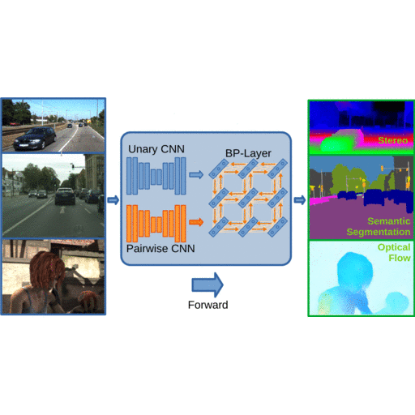
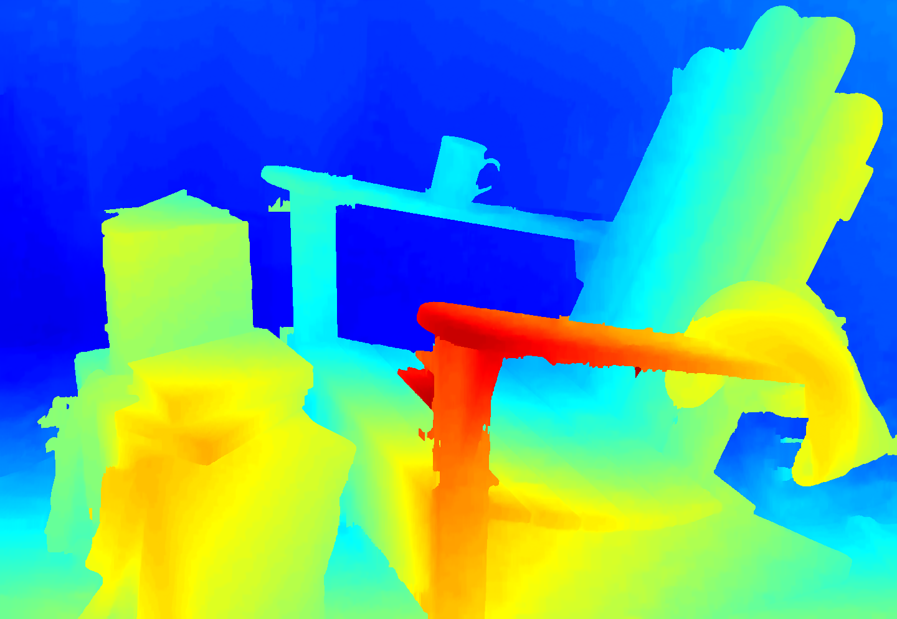
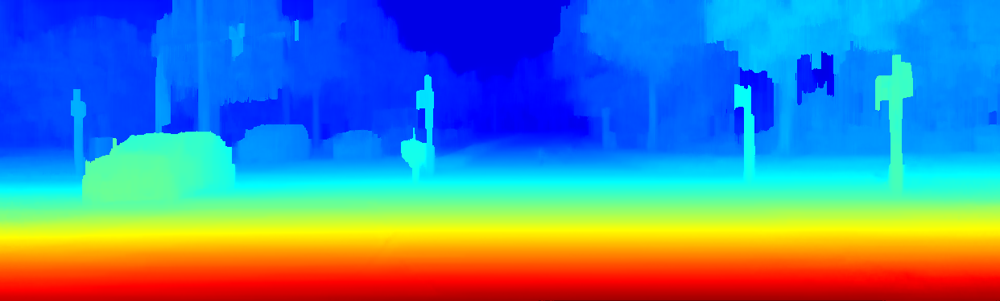
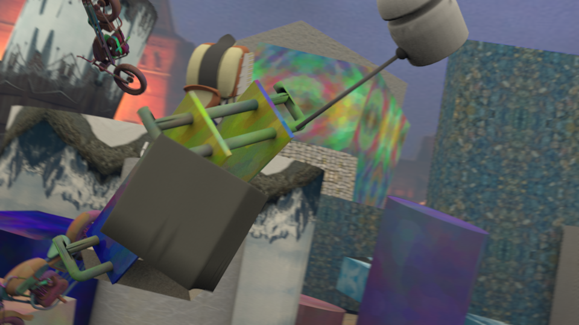
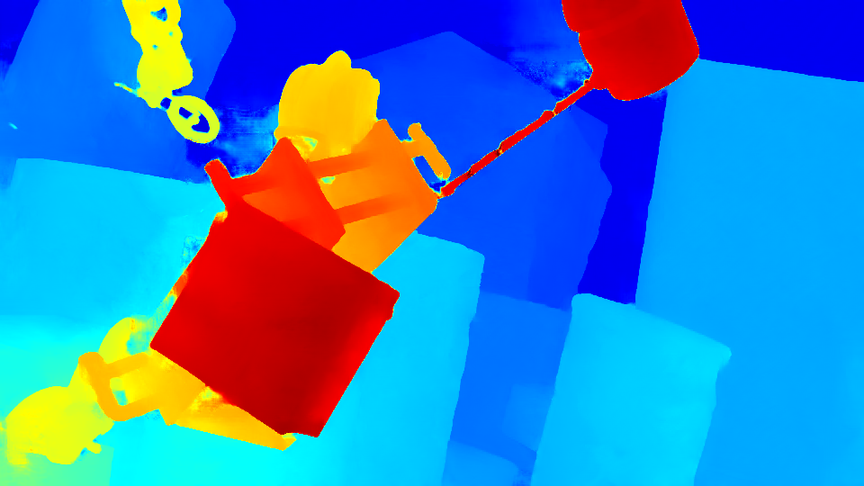
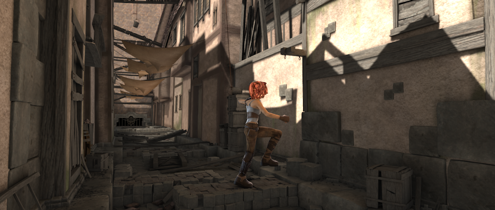

# BP-Layers
This repository contains the implementation for our publication "Belief Propagation Reloaded: Learning BP-Layers for Labeling Problems". If you use this implementation please cite the following publication:

~~~
@InProceedings{Knobelreiter_2020_CVPR,
  author = {Knöbelreiter, Patrick and Sormann, Christian and Shekhovtsov, Alexander and Fraundorfer, Friedrich and Pock, Thomas},
  title = {Belief Propagation Reloaded: Learning BP-Layers for Labeling Problems},
  booktitle = {The IEEE/CVF Conference on Computer Vision and Pattern Recognition (CVPR)},
  month = {June},
  year = {2020}
} 
~~~

## Repository Structure

The repository is structured as follows:
    - the base directory contains scripts for running inference and python implementations of the networks
    - 'data' includes sample images for stereo/semantic/flow inference
    - 'ops' contains custom PyTorch-Ops which need to be installed before running the respective stereo/semantic implementation (note that this is also taken care of by the run_*.sh scripts)

For your convenience, the required libraries are added as submodules. To clone them issue the command 

~~~
git submodule update --init --recursive
~~~

## Dependencies

* Cuda 10.2
* pytorch >= 1.3
* argparse
* imageio (with libpfm installed)*
* numpy

The stereo results are saved as pfm images. If your imageio does not have libpfm installed automatically, execute the following command in a python:

~~~
imageio.plugins.freeimage.download()
~~~

In order to display pfm files we highly recommend the tool provided by the Middlebury stereo benchmark. You can find it <a href="https://github.com/roboception/cvkit">here</a>.

## Running the implementation

After installing all of the required dependencies above you need to install the provided modules to you python environment. This can be done with

~~~
cd ops
python setup.py install
~~~

This will install the SAD matching kernels for stereo and Optical flow. The BP-Layer is installed automatically upon execution of the provided shell scripts. The following sections show how to use them.

### Stereo
* run_stereo_sf.sh: The models trained on the Scene-Flow Dataset
* run_stereo_mb.sh: The model used for evaluation on the Middlebury dataset
* run_stereo_kitti: The model used for evaluation on the Kitti dataset

### Flow
* run_flow.sh

### Semantic Segmentation
* run_semantic_global.sh: Our semantic segmentation model with *global* pairwise weights
* run_semantic_pixel: Our semantic segmentation model with *pixel-wise* pairwise weights

~~~
sh run_semantic_pixel.sh
~~~

Should yield this result:

Inside these scripts you can also specify different images to be used for inference. The correct PyTorch-Ops are also automatically installed by these scripts before running the inference. 